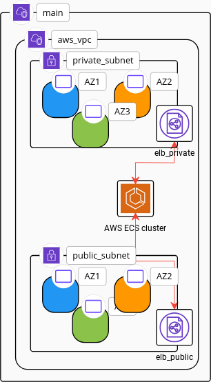
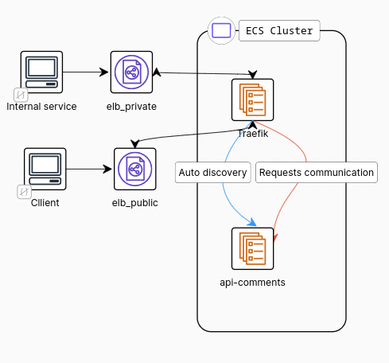
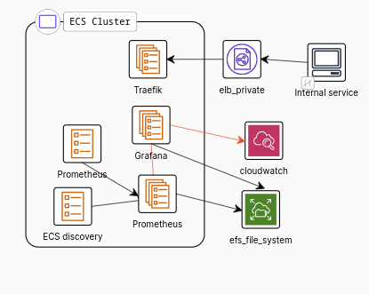
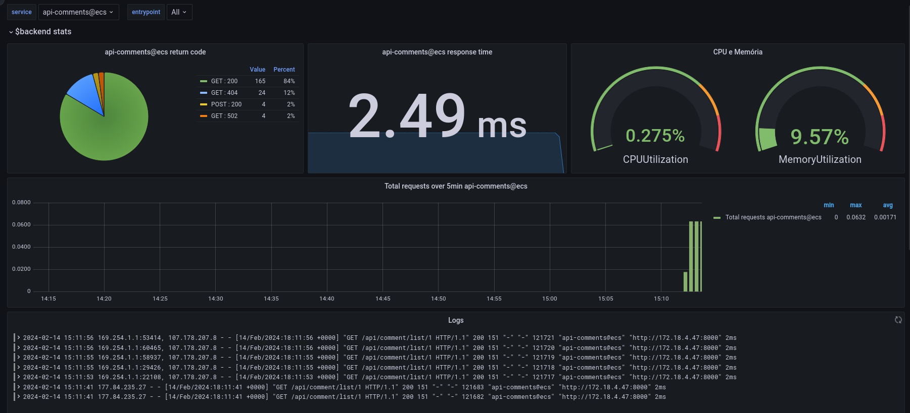
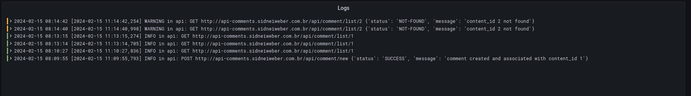
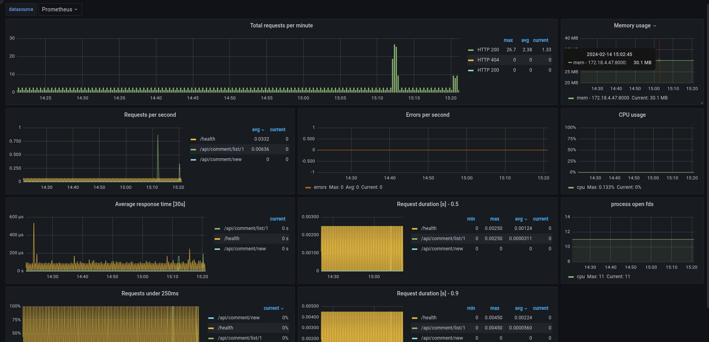

# Definição do cenário
Para facilitar na escolha das ferramentas e estrutura, assim como para justificar as mesmas, decidi definir um cenário hipotético. Todas as decisões e escolhas se baseiam em um cenário de uma empresa/startup de pequeno a médio porte que possivelmente recebeu um investimento recente e está com uma perspectiva de um bom crescimento a curto prazo. Contudo, a equipe ainda não é muito grande, principalmente na equipe de operação. Para suprir a necessidade dos times é necessário que se tenha o maior nível de automação possível, assim como opções de personalizações dos recursos criados. A escolha da stack deve ter uma complexidade baixa e aproveitando recursos nativos sempre que possível. 

# Ferramentas
- AWS. Cloud mais utilizada e com diversos serviços e integrações.
- Ecs Fargate para orquestrar containers. Vantagens: não precisar se preocupar com servidores, escalável, monitoramento e logs feitos pela própria AWS.
- Cloudwatch para métricas e logs. Vangatens: Integração com serviços internos da AWS, custo baixo.
- Grafana para dashboards e alerta. Vantagens: opensource, dinâmico e com diversas integrações como, aws, prometheus, etc.
- Prometheus para métricas. Vantagens: Roda container, diversos exporters para coletar métricas.
- Traefik para ingress. Vantagens: Integração com ecs, diversas funcionalidades integradas, como ratelimit, health check, entre outras.
- Terraform para IAC. Vantagens: Simplicidade, criação de módulos, arquivo de estado.
- Github actions para esteira do código e IAC.

# Estrutura 

## Estrutura base - infra/01-base
A estrutura base é onde a API e serviços rodarão. Teremos subnet públicas e privadas, onde os serviços rodaram na rede privada para não ficarem expostas para a internet. Serão 3 subnets privadas e 3 públicas, cada uma rodando em uma zona de disponibilidade diferente para aumentar a resiliência.

É também criado um load balancer público e um privado. A comunicação interna passaria pelo load balancer interno, o que pode diminuir latência e evitar que o tráfego interno passe pela internet desnecessariamente.

Um cluster ECS será criado para orquestrar nossos containers.



### Observações
- No cenário ideal teríamos duas hosted zones no Route53, uma pública e uma privada e a gestão de dns seria feita nela. Para o teste usei Cloudflare por já estar gerenciando o DNS nesse serviço.

## Traefik - infra/02-traefik

Traefik (pronuncia-se “traffic”) é um proxy reverso e balanceador de carga para microsserviços de código aberto. Traefik pode nos ajudar a subir serviços mais rapidamente sem barrar no excesso de configurações de infra e simplificar o ambiente.

Suporte ao ECS e também há suporte ao Kubernetes, caso posteriormente se tenha necessidade dessa migração. Traefik é escrito em go e é super leve e rápido, como exemplo a imagem docker possui 43MB [imagem-latest](https://hub.docker.com/layers/library/traefik/latest/images/sha256-00cefa1183ba9d8972b24cca4f53f52cad38599ac01f225d11da004ac907c2db?context=explore).

Alguns recursos úteis que o Traefik nos disponibiliza:
- Auto Discovery
- Metrics
- SSL
- Dashboard
- Circuit breakers (LatencyAtQuantileMS, NetworkErrorRatio, ResponseCodeRatio)
- Rate Limit
- Retry (Enable retry sending request if network error)
- Sticky sessions
- Health Check
- Canary deployments (Kubernetes)
- Mirroring (Kubernetes)



### Observações
- Em um cenário ideal seria configurado um autoscaling para o serviço do Traefik aumentar e diminuir as tarefas conforme a demanda. O dashboard também não ficaria exposta para internet ou pelo menos ficaria exposto com alguma autenticação habilitada.

## Services - infra/03-services

Com a nossa base estruturada podemos começar a configurar nosso serviço (api-comments), para isso vamos utilizar o módulo terraform criado para facilitar a criação dos nossos serviços. Módulo se encontra em [infra/modules/ecs-service](infra/modules/ecs-service).

Com a utilização do módulo diminuímos a quantidade de código repetido e no qual um desenvolvedor precisa se preocupar. Em nosso exemplo para criar nosso serviço, precisamos especificar poucas linhas.

```terraform
module "api-comments" {
  source       = "../modules/ecs-service"
  environment  = var.environment
  name         = "api-comments"
  port         = 8000
}
```

Mais opções podem ser especificadas caso o serviço necessite, como, por exemplo:
- Especificar autoscaling, se escala por uso de CPU e memória e qual métrica usar como base.
- Comando ou Entrypoint que a imagem vai utilizar.
- Quantidade de CPU e memória disponível para o container.
- Especificar variáveis de ambiente.
- Personalizar a política IAM do serviço.
- Ajustar e definir health check.
- Definir porta e rota para coleta de métricas do prometheus.
- Configurar rate limit.
- Configurar uso de spot.

Exemplo mais completo:
```terraform
module "api-comments" {
  source                     = "../modules/ecs-service"
  environment                = var.environment
  name                       = "api-comments"
  port                       = 8000
  metrics_path               = "/metrics"
  metrics_port               = 8000
  memory                     = 2048
  cpu                        = 1024
  use_spot                   = true
  auto_scaling_metric        = "cpu"
  auto_scaling_target_value  = 40
  auto_scaling_up_cooldown   = 120
  auto_scaling_down_cooldown = 300
  auto_scaling_min_capacity  = 2
  auto_scaling_max_capacity  = 8
}
```

Foi criado no github actions uma esteira para criar nova imagem de container da aplicação e atualização da mesma no ECS, caso haja alguma alteração de código. https://github.com/sidneiweber/api-comments/actions/runs/7892417671/job/21538844522

### Teste do ratelimit

```shelll
➜ bombardier -l -c 50 -n 100 https://api-comments.sidneiweber.com.br/api/comment/list/1
Bombarding https://api-comments.sidneiweber.com.br:443/api/comment/list/1 with 100 request(s) using 50 connection(s)
 100 / 100 [==================================================] 100.00% 124/s 0s
Done!
Statistics        Avg      Stdev        Max
  Reqs/sec       163.58     347.02    1603.86
  Latency      375.56ms   235.36ms   639.12ms
  Latency Distribution
     50%   142.72ms
     75%   610.08ms
     90%   629.80ms
     95%   634.39ms
     99%   636.03ms
  HTTP codes:
    1xx - 0, 2xx - 21, 3xx - 0, 4xx - 79, 5xx - 0
    others - 0
  Throughput:   414.55KB/s
```

### Observações
- Pipeline foi configurado no repositório somente para os serviços somente para exemplificar. Um plano de execução é gerado e enviado para o comentário do pull request com as alterações. https://github.com/sidneiweber/api-comments/pull/4

## Observability - infra/04-observability

A observabilidade também foi baseado na simplicidade e em um modo de defesa. Considerando a possibilidade das aplicações não estarem instrumentalizadas com métricas, dificultando ter uma visão do ambiente, utilizaremos as informações disponíveis até aqui.

Grafana e Prometheus irão montar um volume no serviço EFS da AWS para persistir os dados de métricas e informações configuradas no Grafana (datasources, dashboards, etc). Para simplificar a configuração do prometheus utilizaremos um sidecar com um serviço que irá realizar uma busca pelos serviços rodando no ECS e que tenham definidos porta (`metrics_port`) e rota (`metrics_path`) para coleta de dados.

Dados que conseguimos coletar de maneira simples e sem recursos avançados.
- Logs do Cloudwatch
- Métricas do Cloudwatch
- Métricas de acessos do Traefik via prometheus



Na imagem abaixo podemos ver dados coletados sem nenhuma alteração no código. Temos quantidade de requests dividos por status code, response time médio, quantidade de cpu e memória utilizados e também os logs de acesso do Traefik.



Adicionando a biblioteca de logs e com uma alteração na aplicação para registrar os logs em cada endpoint, podemos ver uma melhoria no dashboard com os logs. O grafana consegue separar o level dos logs por cores



Realizando uma pequena alteração no código da aplicação, adicionaremos a lib `prometheus_flask_exporter`. Essa lib já nos dará algumas outras métricas direto da aplicação e com um pouco mais de detalhes.



### Observações
- Todos os acessos estão públicos, mas no cenário real estariam privados e acessíveis via VPN.
- Para uma escalabilidade melhor do prometheus adicionaria a ele os componentes do Thanos para armazenar os dados por mais tempo no S3, por exemplo. No modelo do teste prometheus não escala.
- Com tempo possivelmente também seria adicionado a stack o alertmanager.
- Com tempo também seria realizado uma limpeza/exclusão nos dados coletados do traefik, excluir, por exemplo, métricas de acesso às rotas de health check.
- Poderíamos criar os alertas dentro do Grafana ou com a subida do alertmanager, diretamente por ele.
- Adicionaria também os arquivos para autoconfiguração do Grafana, como já cadastrar os datasources e dashboards.

## Observações gerais
Seria interessante com tempo implementar alguma forma de armazenamento dos comentários, eu optaria por um redis que é um banco rápido e bem flexível. Também analisaria, dependendo do orçamento, uma plataforma um pouco mais robusta para armazenamento dos logs.
Aqui faltou uma ferramenta para os traces, eu optaria por uma solução como Grafana Tempo ou Jaeger, fazendo a coleta com opentelemetry. O Opentelemetry facilitaria pelo fato de ter integração com diversas ferramentas, então caso haja necessidade de mudança o esforço seria um pouco menor.

## Links
- API: https://api-comments.sidneiweber.com.br/
- Traefik: https://traefik.sidneiweber.com.br/dashboard/
- Grafana: https://grafana.sidneiweber.com.br (Desligado por motivos de custo)
- Prometheus: https://prometheus.sidneiweber.com.br (Desligado por motivos de custo)

## Referências
- https://cloudcasanova.com/prometheus-service-discovery-for-aws-ecs/
- https://thelinuxnotes.com/index.php/implementing-a-flask-health-check-and-kubernetes-liveness-probe-in-python-application/
- https://pypi.org/project/prometheus-flask-exporter/
- https://grafana.com/docs/grafana/latest/administration/provisioning/
- https://dev.to/suzuki0430/creating-a-github-actions-workflow-to-automatically-comment-with-the-results-of-terraform-plan-during-pull-request-creation-2j52
- https://github.com/fabfuel/ecs-deploy
- https://github.com/netbears/traefik-cluster-ecs
- https://terraform-docs.io
